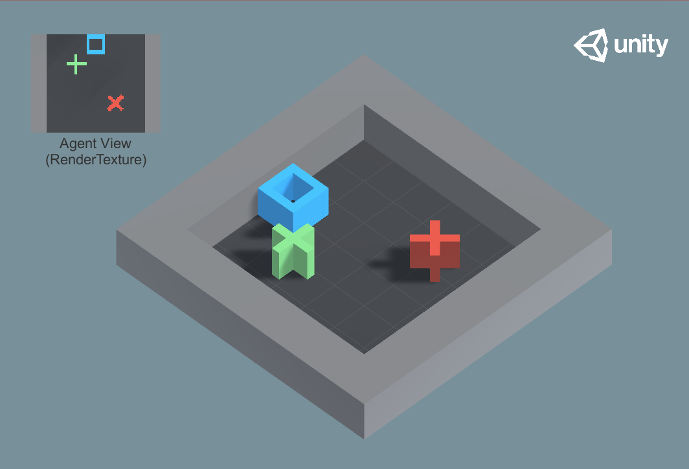
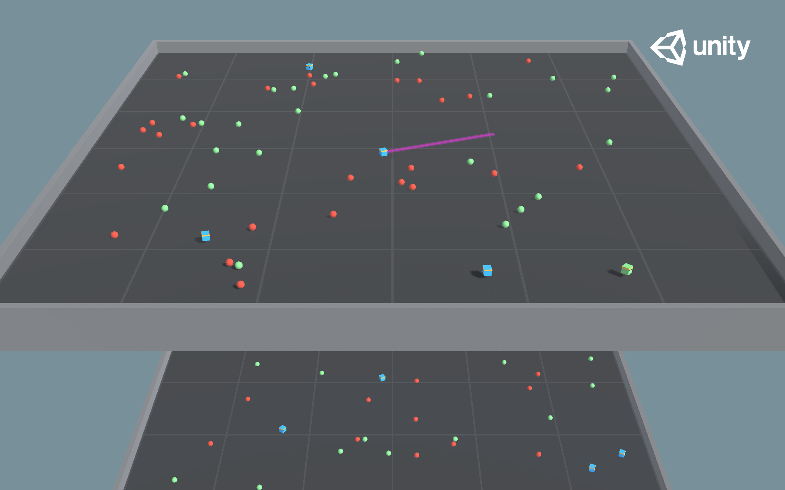

# Social Neuro RL using Unity environments

## Installation:
Python version: 3.6 and above
ML Agents:

    pip install mlagents==0.25.1
    

Link to [ML Agents documentation](https://github.com/Unity-Technologies/ml-agents/blob/release_16_docs/docs/Readme.md)

## Environments
### Environment details
#### GridWorld

- Set-up: A version of the classic grid-world task. Scene contains agent, goal,
  and obstacles.
- Goal: The agent must navigate the grid to the goal while avoiding the
  obstacles.
- Agents: The environment contains nine agents with the same Behavior
  Parameters.
- Agent Reward Function:
  - -0.01 for every step.
  - +1.0 if the agent navigates to the goal position of the grid (episode ends).
  - -1.0 if the agent navigates to an obstacle (episode ends).
- Behavior Parameters:
  - Vector Observation space: None
  - Actions: 1 discrete action branch with 5 actions, corresponding to movement in
    cardinal directions or not moving. Note that for this environment,
    [action masking](Learning-Environment-Design-Agents.md#masking-discrete-actions)
    is turned on by default (this option can be toggled using the `Mask Actions`
    checkbox within the `trueAgent` GameObject). The trained model file provided
    was generated with action masking turned on.
  - Visual Observations: One corresponding to top-down view of GridWorld.
- Float Properties: Three, corresponding to grid size, number of obstacles, and
  number of goals.
- Benchmark Mean Reward: 0.8
- Environment variables: number of goals, number of obstacles, is respwan, respwan frequency, number of agents etc

#### Food Collector

- Set-up: A multi-agent environment where agents compete to collect food.
- Goal: The agents must learn to collect as many green food spheres as possible
  while avoiding red spheres.
- Agents: The environment contains 5 agents with same Behavior Parameters.
- Agent Reward Function (independent):
  - +1 for interaction with green spheres
  - -1 for interaction with red spheres
- Behavior Parameters:
  - Vector Observation space: 53 corresponding to velocity of agent (2), whether
    agent is frozen and/or shot its laser (2), plus grid based perception of
    objects around agent's forward direction (40 by 40 with 6 different categories).
  - Actions:
    - 3 continuous actions correspond to Forward Motion, Side Motion and Rotation
    - 1 discrete acion branch for Laser with 2 possible actions corresponding to
      Shoot Laser or No Action
  - Visual Observations (Optional): First-person camera per-agent, plus one vector
    flag representing the frozen state of the agent. This scene uses a combination
    of vector and visual observations and the training will not succeed without
    the frozen vector flag. Use `VisualFoodCollector` scene.
- Float Properties: Two
  - laser_length: Length of the laser used by the agent
    - Default: 1
    - Recommended Minimum: 0.2
    - Recommended Maximum: 7
  - agent_scale: Specifies the scale of the agent in the 3 dimensions (equal
    across the three dimensions)
    - Default: 1
    - Recommended Minimum: 0.5
    - Recommended Maximum: 5
- Benchmark Mean Reward: 10
- Environment variables: number of good food, number of bad food, is respwan, respwan frequency, number of agents etc

### Create the Environment Binary File
Download the unity projects from [here](https://github.com/RaghuHemadri/Social-Neuro-RL-using-Unity-environments/blob/main/environments.zip)

* Copy them to mlagents/project/assets/ml-agents/Examples
* Open the project from unity engine
* Goto 'build settings' in 'file'
* Add currently open scene to build
* Select the target platform and architecture
* Click on 'Build'
* Save the file

The environments for linux are available [here](https://drive.google.com/drive/folders/10FN4doUEXNXPX6uBvHp2VVPPS4kgRfP6?usp=sharing)

## Demos

* The demo for using unity environment is available in [env_demo.ipynb](https://github.com/RaghuHemadri/Social-Neuro-RL-using-Unity-environments/blob/main/env_demo.ipynb)
* A Q-Learning demo on grid-world environment is avvailable in [grid_world_Q_learning.ipynb](https://github.com/RaghuHemadri/Social-Neuro-RL-using-Unity-environments/blob/main/grid_world_Q_learning.ipynb)
* PPO results on food collector environment are available [here](https://docs.google.com/spreadsheets/d/1j2y0TfjD7djFnwiGHCCrySsPXsEHRcUf8e3km5vb1pw/edit?usp=sharing)
